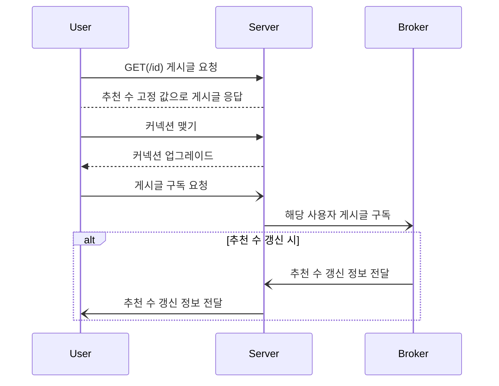

SSE와 웹소켓을 비교하며, 현재 [SuperBoard 프로젝트](https://github.com/GoGradually/SuperBoard)에 적용할 방식을 고민하기 위한 프로젝트

# SSE

text/event-stream으로 단방향 스트리밍

브라우저가 자동 재연결·Last-Event-ID 관리 내장

SSE 프록시나 로드밸런서에서 SSE 스트리밍을 긴 폴링으로 오인해 커넥션 타임아웃 위험

텍스트 UTF-8 전용 단방향 스트리밍. 단방향만 필요하다면 유용함.

Transfer-Encoding: chunked 로 전송하기 때문에, 프록시에서 최적화를 위해 proxy buffering을 적용할 수도 있음

### 스케일 아웃을 가정하면?

직접 이벤트를 애플리케이션 코드로 작성 & 메시지 브로커와 클라이언트 간의 발행/구독 정보를 연결하기 위한 중간 계층을 구현해야 함.

# WebSocket
### 웹소켓의 동작 방식
- HTTP 업그레이드 핸드셰이크를 거치고 나면
- 클라이언트 - (프록시) - 서버 간 유지되는 터널이 생긴다.
  - 정확히 말하자면, 기존에 요청-응답 시 사용했던 파이프를 그대로 웹소켓 터널로 사용한다.
- 이를 양방향 통신을 위한 파이프로 사용한다.
- 특정 인스턴스에 커넥션이 오래 유지되면, LB가 라우팅하기 어려워지지 않나?
  - RR로 못하게 되니, 좀 까다로워질 것 같은데

> 이 문제 개선 가능한가?
> 
> 결국 양 끝단 간 연결은 어딘가에 유지되어야 한다. 연결 유지 안하겠다고 매번 새로 맺는게 더 큰 오버헤드일 듯 하다. (테스트 해봐야 암)
> 
> 메시지 브로커 사용 + LB의 라우팅 방식을 RR이 아닌 다른 방식으로 바꾸는 것이 좋아보인다.
- 별도의 웹소켓용 인스턴스를 두고, 거기서 커넥션을 명시적으로 책임을 분리하여 관리하는 것이 좋을 듯

- 바이너리 프레임 전송 가능, 서브프로토콜(STOMP, MQTT 등) 얹기 쉬움

### 스케일 아웃을 가정하면?

STOMP 사용 시 **BrokerRelay 기능을 통한 빠른 구독 토픽 전환 & 이벤트 발행 가능**

**STOMP의 브로커 릴레이를 켜면, "어떤 세션이 어떤 토픽을 구독했는가"라는 정보를 WAS에 저장할 필요가 없음**

> 웹소켓의 sticky session 문제라는게 있던데? 이건 괜찮나?
> 
> Stickiy Session 문제는 메시지 브로커를 쓰는 순간 해결된다. WAS가 가질 상태를 DB가 갖게 하고, 그 상태를 메시지 브로커와 토픽으로 관리하는 것

# 모르겠다. 해봐야겠다.

## 요구사항
- 객체에 증가 요청 호출
- MySQL DB에 저장되어 있음
- 호출 후 이벤트 발행
- 구독 지점에서 클라이언트에 데이터 전달
- 실패 시 실패 메시지 전달

## SSE + HTTP POST 모델링

## STOMP 모델링

## 추천 수 추가 로직은 어떻게?
- 여기서 동시성 문제 터지는 것이 성능 결과에 영향을 끼칠 가능성 존재
- 추천 수 추가/삭제 작업은 **비멱등 쓰기 작업**임
1. 이벤트로 처리
   - 메모리 사용 시, 이벤트 소실 시 대처 불가
   - DB + 트랜잭션 아웃박스 사용 시, Exactly Once 문제 때문에 멱등 키 + 유니크 제약조건 도입 필요
   - 본질적으로 쓰기 작업이기 때문에, 쓰로틀링을 시도하려 해도 이벤트 기록부에 락이 필요함.
2. 낙관적 락
   - 충돌 가능성이 적은 상황에 유리
   - TPS를 측정하려는 상황이므로, 낙관적 락은 고려하지 않음
3. 비관적 락
   - 락 관리 오버헤드 존재
   - 하지만 동시성이 높은 상황에서, 안전한 결과 보장

> 비관적 락 선택

## 검증 시나리오

- 1000명의 추천용 VU, 1명의 조회용 VU
- 1, 10, 1000명의 추천 로직 수행
  - 초당 N번
- 1000명은  로직의 결과값 확인
  - 응답의 메시지의 작성 시간 확인
  - 도착 시간과 비교하여 지연 시간 확인

## SSE의 테스트 결과

## WebSocket + STOMP의 테스트 결과